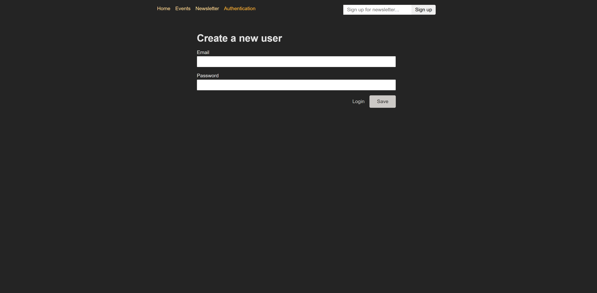

# React Authentication 프로젝트



## 📖 프로젝트 개요

이 프로젝트는 React와 Node.js를 사용하여 완전한 사용자 인증 시스템을 구현한 학습 프로젝트입니다. JWT(JSON Web Token)를 활용한 토큰 기반 인증 방식을 학습하고, 프론트엔드와 백엔드 간의 인증 플로우를 구현했습니다.

## 🚀 주요 학습 내용

### 1. JWT 토큰 기반 인증

- **JWT 생성 및 검증**: `jsonwebtoken` 라이브러리를 사용한 토큰 생성
- **토큰 만료 시간 설정**: 1시간 후 자동 만료되는 토큰
- **토큰 검증 미들웨어**: API 요청 시 토큰 유효성 확인

### 2. 백엔드 인증 시스템 (Node.js + Express)

- **회원가입 API** (`/signup`): 새 사용자 등록 및 비밀번호 해싱
- **로그인 API** (`/login`): 사용자 인증 및 JWT 토큰 발급
- **비밀번호 암호화**: `bcryptjs`를 사용한 안전한 비밀번호 저장
- **입력 유효성 검사**: 이메일 형식 및 비밀번호 최소 길이 검증

### 3. 프론트엔드 인증 구현 (React + React Router)

- **React Router Dom v7** 사용한 라우팅
- **Form 기반 인증**: React Router의 Form 컴포넌트 활용
- **로그인/회원가입 토글**: URL 파라미터로 모드 전환
- **토큰 관리**: localStorage를 통한 토큰 저장 및 관리

### 4. 인증 상태 관리

- **토큰 유효성 검사**: 토큰 만료 시간 확인
- **자동 리다이렉트**: 미인증 사용자의 보호된 라우트 접근 제한
- **조건부 UI 렌더링**: 인증 상태에 따른 네비게이션 메뉴 변경
- **자동 로그아웃**: 토큰 만료 시 자동 로그아웃

### 5. 보호된 라우트 구현

- **Loader 함수 활용**: 라우트 접근 전 인증 상태 확인
- **checkAuthLoader**: 인증이 필요한 페이지 보호
- **tokenLoader**: 전역 인증 상태 관리

## 🛠️ 기술 스택

### Backend

- **Node.js**: 서버 런타임 환경
- **Express**: 웹 애플리케이션 프레임워크
- **JWT (jsonwebtoken)**: 토큰 기반 인증
- **bcryptjs**: 비밀번호 해싱
- **body-parser**: HTTP 요청 본문 파싱

### Frontend

- **React 19**: 사용자 인터페이스 라이브러리
- **React Router Dom v7**: 클라이언트 사이드 라우팅
- **CSS Modules**: 컴포넌트 스타일링

## 📁 프로젝트 구조

```
react-authentication/
├── backend/
│   ├── routes/auth.js          # 인증 라우트 (로그인/회원가입)
│   ├── util/auth.js            # JWT 관련 유틸리티
│   ├── util/validation.js      # 입력 검증 함수
│   ├── data/user.js            # 사용자 데이터 관리
│   └── app.js                  # Express 서버 설정
└── frontend/
    ├── src/
    │   ├── components/
    │   │   ├── AuthForm.js     # 인증 폼 컴포넌트
    │   │   └── MainNavigation.js # 인증 상태 기반 네비게이션
    │   ├── pages/
    │   │   ├── Authentication.js # 인증 페이지
    │   │   └── Logout.js       # 로그아웃 액션
    │   ├── util/auth.js        # 클라이언트 인증 유틸리티
    │   └── App.js              # 라우터 설정
    └── public/
```

## 🔑 핵심 구현 기능

### 1. 회원가입 & 로그인

- 이메일/비밀번호 기반 인증
- 실시간 폼 유효성 검사
- 에러 메시지 표시

### 2. 토큰 관리

- localStorage에 토큰 저장
- 토큰 만료 시간 추적
- 만료된 토큰 자동 제거

### 3. 보호된 라우트

- 인증 없이 접근 불가능한 페이지
- 자동 로그인 페이지 리다이렉트

### 4. 사용자 경험

- 로딩 상태 표시
- 인증 상태에 따른 UI 변화
- 자동 로그아웃 기능

## 🚦 실행 방법

### Backend 실행

```bash
cd backend
npm install
npm start
```

서버가 `http://localhost:8080`에서 실행됩니다.

### Frontend 실행

```bash
cd frontend
npm install
npm start
```

React 앱이 `http://localhost:3000`에서 실행됩니다.

## 📚 학습 포인트

1. **JWT의 이해**: 토큰 기반 인증의 원리와 구현
2. **React Router의 고급 기능**: Loader, Action 함수 활용
3. **폼 처리**: React Router Form을 통한 서버 통신
4. **상태 관리**: 전역 인증 상태 관리 방법
5. **보안**: 비밀번호 해싱과 토큰 기반 인증의 중요성
6. **사용자 경험**: 로딩 상태와 에러 처리

이 프로젝트를 통해 실제 웹 애플리케이션에서 사용되는 인증 시스템의 전체적인 구조와 구현 방법을 학습할 수 있었습니다.
